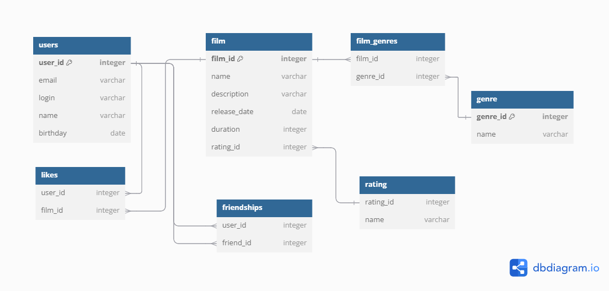

# java-filmorate
Template repository for Filmorate project.

## Пояснение к схеме

Эта схема базы данных описывает структуру приложения для управления фильмами и пользователями. Она включает таблицы для хранения информации о пользователях, фильмах, жанрах и дружбе между пользователями.

### Примеры запросов

#### 1. Получение всех пользователей

sql
SELECT * FROM users;

#### 2. Получение всех фильмов
sql
SELECT * FROM film;

#### 3. Получение топ N наиболее популярных фильмов (предполагается, что популярность определяется по количеству лайков)
sql
SELECT f.*, COUNT(l.user_id) AS like_count
FROM film f
LEFT JOIN likes l ON f.film_id = l.film_id
GROUP BY f.film_id
ORDER BY like_count DESC
LIMIT N;

#### 4. Получение списка общих друзей с другим пользователем
sql
SELECT u1.*
FROM users u1
JOIN friendships f1 ON u1.user_id = f1.friend_id
JOIN friendships f2 ON f1.friend_id = f2.friend_id
WHERE f2.user_id = u1.user_id;

